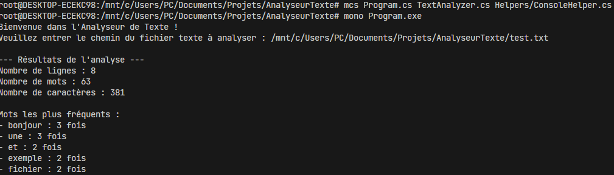

# TextAnalyzerApp

**TextAnalyzerApp** est une application console en C# permettant d'analyser un fichier texte. L'outil fournit des statistiques essentielles telles que le nombre de lignes, de mots, de caractères, ainsi que les mots les plus fréquents dans le texte.

## Fonctionnalités

- **Analyse des lignes** : Compte le nombre de lignes dans le texte.
- **Analyse des mots** : Compte le nombre total de mots.
- **Analyse des caractères** : Compte le nombre total de caractères.
- **Mots les plus fréquents** : Identifie les 5 mots les plus fréquemment utilisés dans le texte.

## Exécution

### Prérequis

- Un fichier texte à analyser.

### Étapes

1. Clonez le dépôt :

   ```bash
   git clone https://github.com/ugurkaya67/AnalyseurTexte.git

2. Compilez le projet avec mcs :

Depuis le répertoire du projet, utilisez la commande suivante pour compiler tous les fichiers source :

bash
Copier le code
mcs Program.cs TextAnalyzer.cs Helpers/ConsoleHelper.cs
Cette commande génère un fichier exécutable nommé Program.exe.

3. Exécutez l'application avec mono :

Utilisez Mono pour exécuter l'application générée :

bash
Copier le code
mono Program.exe

4. Fournissez le chemin du fichier texte :

L'application vous demandera de saisir le chemin du fichier texte à analyser. 
Par exemple :
Veuillez entrer le chemin du fichier texte à analyser : /mnt/c/Users/PC/Documents/Projets/AnalyseurTexte/test.txt

5. Visualisez les résultats :

L'application affichera les résultats dans la console, comme suit :

